# 🏗️ Advanced Live Chat SaaS - Complete System Architecture

## 🎯 System Overview Architecture

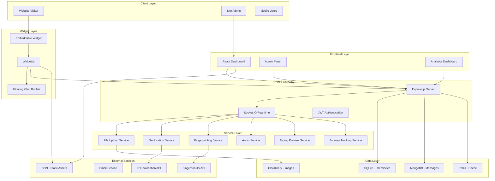

---

## 🔄 Visitor Connection Flow with Advanced Features

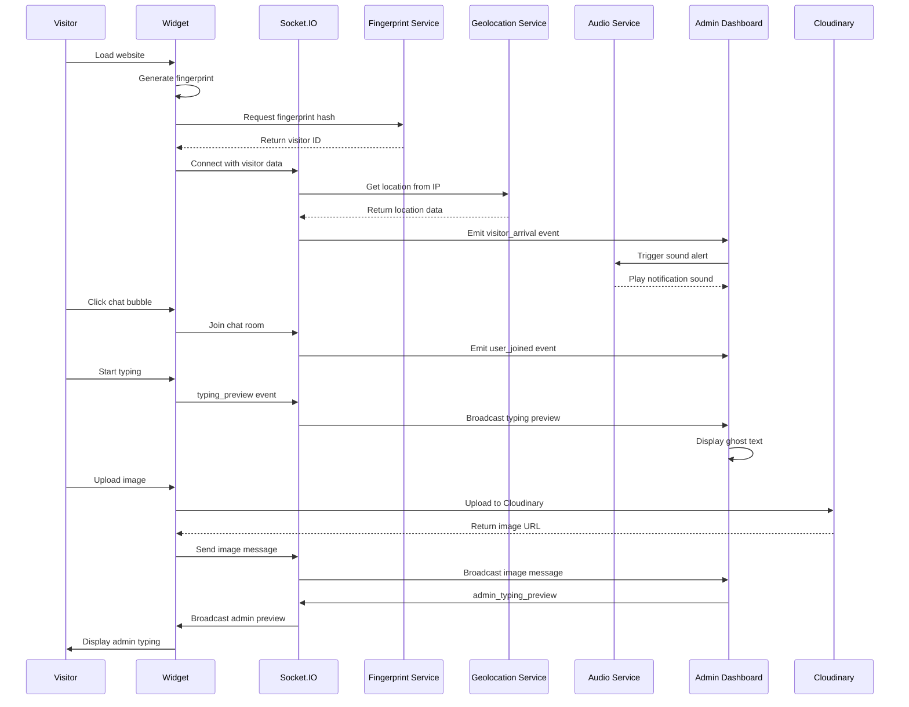

---

## 📸 Image Upload Architecture

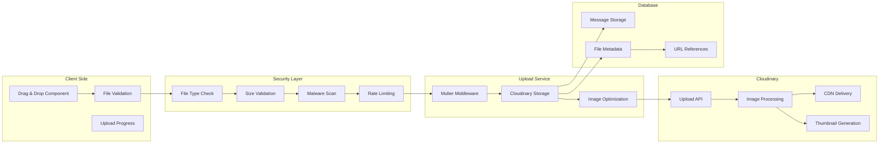

---

## 🌍 Geolocation & Fingerprinting Flow

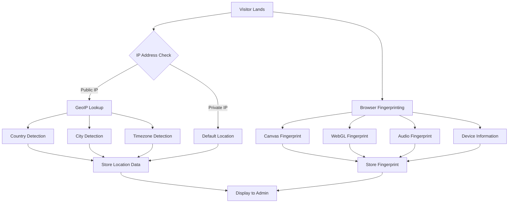

---

## 🔊 Real-Time Sound System Architecture

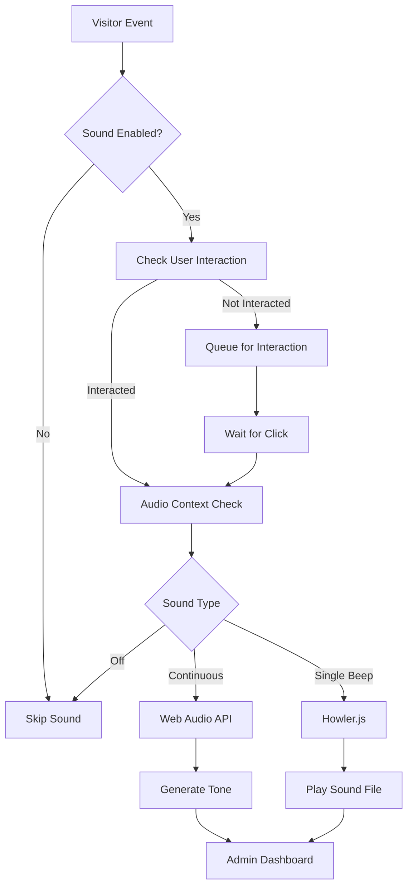

---

## 👁️ Typing Preview Real-Time Flow

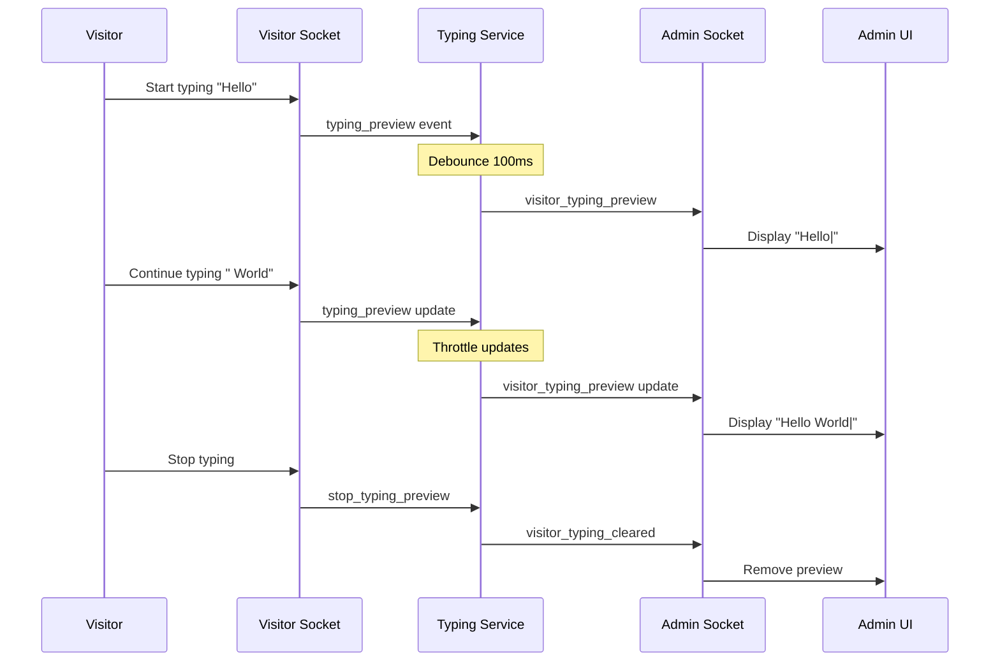

---

## 🛤️ Visitor Journey Tracking

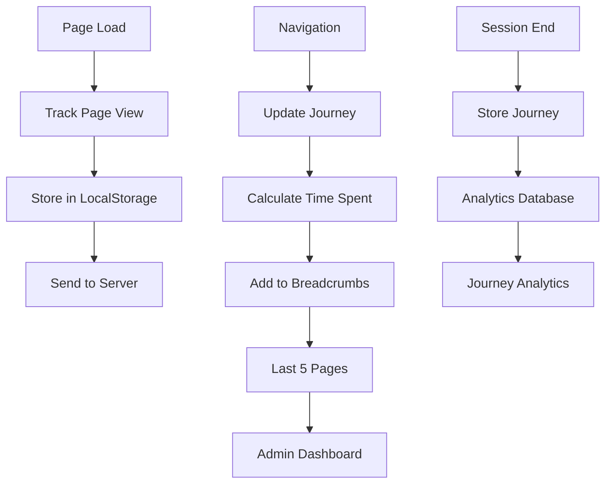

---

## 🗄️ Data Flow Architecture

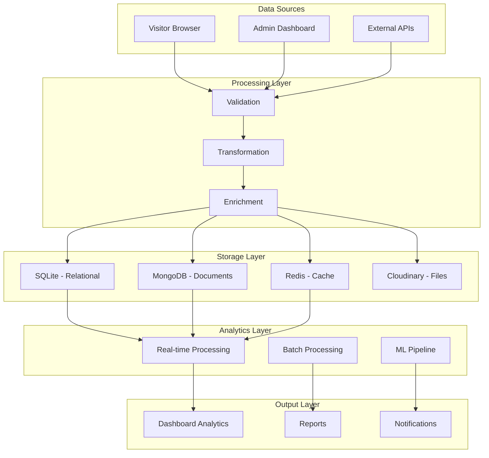

---

## 🔒 Security Architecture

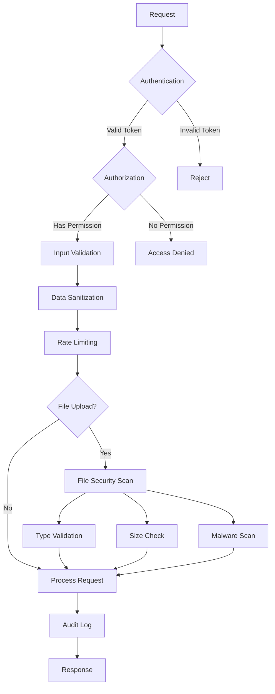

---

## 📊 Performance Monitoring Architecture

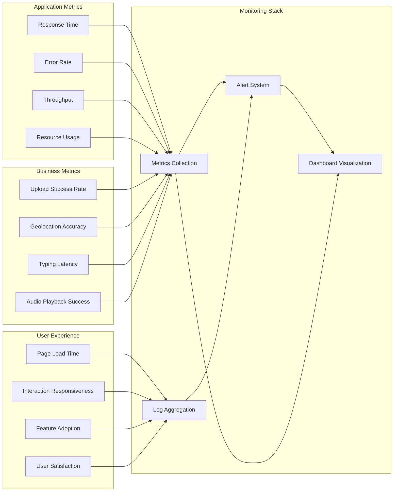

---

## 🚀 Deployment Architecture

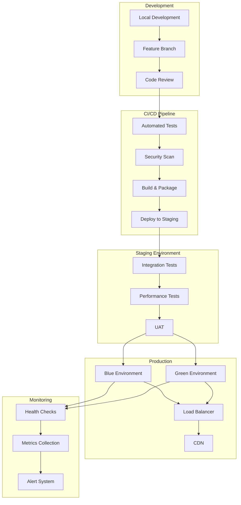

---

## 📈 Scalability Architecture

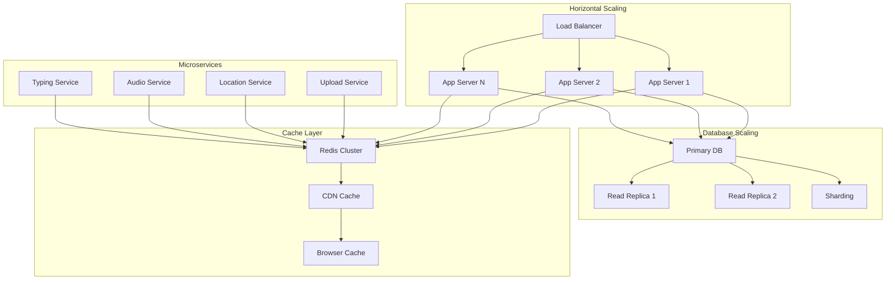

---

## 🔧 Technology Stack Visualization

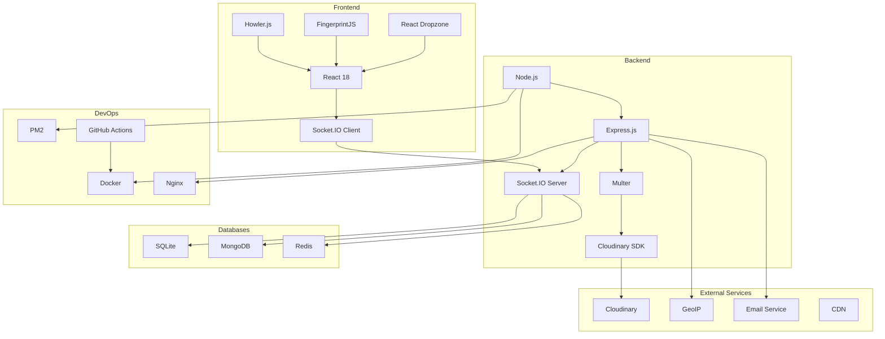

---

## 📋 Component Interaction Matrix

| Component | Triggers | Listens To | Updates | Dependencies |
|-----------|----------|------------|---------|--------------|
| **Image Upload** | File drop/selection | Upload progress | Chat message | Cloudinary, Security |
| **Geolocation** | IP detection | Location data | Visitor info | GeoIP service |
| **Fingerprinting** | Page load | Browser data | Visitor ID | FingerprintJS |
| **Sound Service** | Visitor events | Settings changes | Audio playback | Web Audio API |
| **Typing Preview** | Input changes | Socket events | Preview display | Socket.IO |
| **Journey Tracker** | Navigation | Page changes | Breadcrumbs | LocalStorage |

---

## 🎯 Key Integration Points

### Critical Flows
1. **Visitor Arrival**: Widget → Socket.IO → Geolocation → Sound Alert → Admin
2. **Image Upload**: Dropzone → Validation → Cloudinary → Message → Broadcast
3. **Typing Preview**: Input → Throttle → Socket → Preview → Display
4. **Journey Tracking**: Navigation → Store → Update → Visualize

### Shared Resources
- **Socket.IO Rooms**: Site-based isolation
- **Redis Cache**: Location & fingerprint data
- **Cloudinary**: Image storage & processing
- **Database Connections**: Pool management

### Event Coordination
- **Real-time Events**: Bidirectional Socket.IO communication
- **State Synchronization**: Redux/Zustand state management
- **Error Handling**: Centralized error boundaries
- **Performance**: Debounced updates and lazy loading

---

This comprehensive architecture diagram provides a complete visual representation of the Advanced Live Chat SaaS system with all the advanced features integrated.