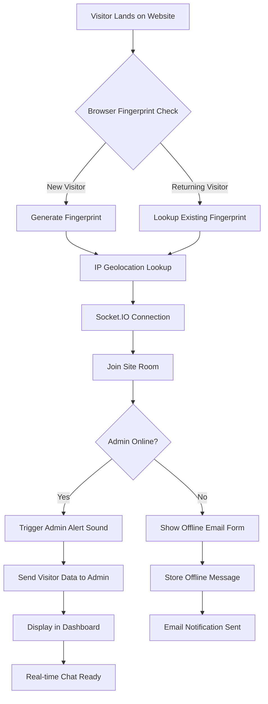

# 🚀 Advanced Live Chat SaaS - Feature Specification & Implementation Strategy

## 📋 Executive Summary

This document provides a comprehensive technical specification for implementing advanced features in the Advanced Live Chat SaaS platform, including real-time image uploads, visitor geolocation, device fingerprinting, enhanced admin productivity tools, and visitor engagement features.

---

## 🏗️ Visitor Connection Flow Architecture



---

## 📦 Technology Stack Recommendations

### 🔧 Core Dependencies

#### Backend NPM Packages
```json
{
  "dependencies": {
    "multer": "^1.4.5-lts.1",           // File upload handling
    "cloudinary": "^1.41.0",            // Image storage & optimization
    "multer-storage-cloudinary": "^4.0.0", // Cloudinary storage adapter
    "geoip-lite": "^1.4.9",             // IP geolocation lookup
    "ua-parser-js": "^1.0.37",          // User agent parsing
    "canvas": "^2.11.2",                // Browser fingerprinting
    "nodemailer": "^6.9.8",             // Email notifications
    "rate-limiter-flexible": "^4.0.1",   // Upload rate limiting
    "sharp": "^0.33.0",                 // Image processing
    "file-type": "^18.7.0",             // File type detection
    "clamscan": "^2.2.1"                // Antivirus scanning
  }
}
```

#### Frontend NPM Packages
```json
{
  "dependencies": {
    "react-dropzone": "^14.2.3",        // Drag & drop file uploads
    "@fingerprintjs/fingerprintjs": "^4.2.2", // Advanced fingerprinting
    "axios": "^1.6.2",                  // HTTP client (existing)
    "socket.io-client": "^4.7.4",       // Real-time communication (existing)
    "react-hot-toast": "^2.4.1",        // Notifications
    "date-fns": "^2.30.0",              // Date formatting
    "react-intersection-observer": "^9.5.3", // Infinite scroll
    "lodash.debounce": "^4.0.8",        // Input debouncing
    "howler": "^2.2.4",                 // Cross-browser audio
    "react-icons": "^4.12.0"            // Icon library
  }
}
```

---

## 🗄️ Database Schema Updates

### 1. Users Table Enhancements
```sql
ALTER TABLE users ADD COLUMN avatar_url VARCHAR(500);
ALTER TABLE users ADD COLUMN avatar_public_id VARCHAR(255);
ALTER TABLE users ADD COLUMN notification_settings JSON DEFAULT '{}';
```

### 2. Visitors Table Enhancements
```sql
ALTER TABLE visitors ADD COLUMN fingerprint_hash VARCHAR(64) UNIQUE;
ALTER TABLE visitors ADD COLUMN ip_address VARCHAR(45);
ALTER TABLE visitors ADD COLUMN country VARCHAR(2);
ALTER TABLE visitors ADD COLUMN city VARCHAR(100);
ALTER TABLE visitors ADD COLUMN region VARCHAR(100);
ALTER TABLE visitors ADD COLUMN timezone VARCHAR(50);
ALTER TABLE visitors ADD COLUMN coordinates VARCHAR(50); -- "lat,lng"
ALTER TABLE visitors ADD COLUMN user_agent TEXT;
ALTER TABLE visitors ADD COLUMN device_info JSON DEFAULT '{}';
ALTER TABLE visitors ADD COLUMN last_pages JSON DEFAULT '[]'; -- Breadcrumb trail
```

### 3. New Tables

#### Visitor Sessions
```sql
CREATE TABLE visitor_sessions (
  id INTEGER PRIMARY KEY AUTOINCREMENT,
  visitor_id INTEGER REFERENCES visitors(id) ON DELETE CASCADE,
  site_id INTEGER REFERENCES sites(id) ON DELETE CASCADE,
  session_token VARCHAR(64) UNIQUE NOT NULL,
  started_at TIMESTAMP DEFAULT CURRENT_TIMESTAMP,
  ended_at TIMESTAMP,
  page_views JSON DEFAULT '[]',
  ip_address VARCHAR(45),
  user_agent TEXT,
  active BOOLEAN DEFAULT TRUE
);
```

#### Canned Responses
```sql
CREATE TABLE canned_responses (
  id INTEGER PRIMARY KEY AUTOINCREMENT,
  user_id INTEGER REFERENCES users(id) ON DELETE CASCADE,
  shortcut VARCHAR(20) NOT NULL,
  message TEXT NOT NULL,
  category VARCHAR(50),
  is_active BOOLEAN DEFAULT TRUE,
  created_at TIMESTAMP DEFAULT CURRENT_TIMESTAMP,
  updated_at TIMESTAMP DEFAULT CURRENT_TIMESTAMP,
  UNIQUE(user_id, shortcut)
);
```

#### Chat Transcripts
```sql
CREATE TABLE chat_transcripts (
  id INTEGER PRIMARY KEY AUTOINCREMENT,
  session_id INTEGER REFERENCES visitor_sessions(id) ON DELETE CASCADE,
  site_id INTEGER REFERENCES sites(id) ON DELETE CASCADE,
  visitor_email VARCHAR(255),
  transcript_data JSON NOT NULL,
  delivered_at TIMESTAMP,
  created_at TIMESTAMP DEFAULT CURRENT_TIMESTAMP
);
```

### 4. Messages Table Enhancements (MongoDB)
```javascript
{
  _id: ObjectId,
  siteId: String,
  sessionId: String,
  sender: {
    type: 'visitor' | 'admin',
    id: String,
    name: String,
    avatar?: String
  },
  message: {
    type: 'text' | 'image' | 'file',
    text: String,
    fileUrl?: String,
    fileName?: String,
    fileSize?: Number,
    mimeType?: String
  },
  metadata: {
    ipAddress: String,
    userAgent: String,
    timestamp: Date,
    edited: Boolean,
    editedAt: Date
  }
}
```

---

## 🔊 Sound Architecture Implementation

### Browser Autoplay Policy Compliance
```javascript
// SoundManager.js - Backend Service
class SoundManager {
  constructor() {
    this.sounds = {
      visitorArrival: new Audio('./sounds/visitor-arrival.mp3'),
      newMessage: new Audio('./sounds/new-message.mp3'),
      typingIndicator: new Audio('./sounds/typing.mp3')
    };
    this.audioContext = null;
    this.isInitialized = false;
  }

  async initializeAudio() {
    if (this.isInitialized) return;
    
    // Create Web Audio Context for better control
    this.audioContext = new (window.AudioContext || window.webkitAudioContext)();
    
    // Create silent audio to unlock browser
    const silentBuffer = this.audioContext.createBuffer(1, 1, 22050);
    const source = this.audioContext.createBufferSource();
    source.buffer = silentBuffer;
    source.connect(this.audioContext.destination);
    source.start();
    
    this.isInitialized = true;
  }

  async playSound(soundName, options = {}) {
    const { loop = false, volume = 0.7, continuous = false } = options;
    
    if (!this.isInitialized) {
      await this.initializeAudio();
    }

    const sound = this.sounds[soundName];
    if (!sound) return;

    // Handle user gesture requirement
    if (this.audioContext.state === 'suspended') {
      await this.audioContext.resume();
    }

    sound.volume = volume;
    sound.loop = loop;
    
    if (continuous) {
      // For continuous loop, use Web Audio API for better control
      this.startContinuousLoop(sound, volume);
    } else {
      sound.currentTime = 0;
      await sound.play().catch(e => {
        console.warn('Audio playback blocked:', e);
      });
    }
  }

  startContinuousLoop(sound, volume) {
    // Stop any existing loop
    this.stopContinuousLoop();
    
    // Create oscillator for continuous tone
    this.continuousOscillator = this.audioContext.createOscillator();
    this.continuousGain = this.audioContext.createGain();
    
    this.continuousOscillator.type = 'sine';
    this.continuousOscillator.frequency.setValueAtTime(800, this.audioContext.currentTime);
    
    this.continuousGain.gain.setValueAtTime(volume * 0.1, this.audioContext.currentTime);
    
    this.continuousOscillator.connect(this.continuousGain);
    this.continuousGain.connect(this.audioContext.destination);
    
    this.continuousOscillator.start();
  }

  stopContinuousLoop() {
    if (this.continuousOscillator) {
      this.continuousOscillator.stop();
      this.continuousOscillator = null;
    }
  }
}
```

### Admin Dashboard Sound Settings
```javascript
// AdminSoundSettings.jsx
const AdminSoundSettings = () => {
  const [soundSettings, setSoundSettings] = useState({
    visitorArrival: {
      enabled: true,
      type: 'continuous', // 'continuous' | 'beep' | 'off'
      volume: 0.7,
      frequency: 800 // Hz for continuous tone
    },
    newMessage: {
      enabled: true,
      volume: 0.5
    }
  });

  const handleUserInteraction = async () => {
    // Initialize audio on first user interaction
    await soundManager.initializeAudio();
  };

  useEffect(() => {
    // Request audio permission on component mount
    document.addEventListener('click', handleUserInteraction, { once: true });
    
    return () => {
      document.removeEventListener('click', handleUserInteraction);
    };
  }, []);

  return (
    <div className="sound-settings">
      <h4>Sound Notifications</h4>
      <div className="setting-group">
        <label>Visitor Arrival Alert</label>
        <select 
          value={soundSettings.visitorArrival.type}
          onChange={(e) => updateSoundSetting('visitorArrival', 'type', e.target.value)}
        >
          <option value="off">Off</option>
          <option value="beep">Short Beep</option>
          <option value="continuous">Continuous Loop</option>
        </select>
      </div>
      <div className="setting-group">
        <label>Volume</label>
        <input
          type="range"
          min="0"
          max="1"
          step="0.1"
          value={soundSettings.visitorArrival.volume}
          onChange={(e) => updateSoundSetting('visitorArrival', 'volume', parseFloat(e.target.value))}
        />
      </div>
    </div>
  );
};
```

---

## 👁️ Real-Time "Sneak Peek" Implementation

### Socket.IO Events for Typing Preview
```javascript
// backend/services/SocketService.js
class SocketService {
  constructor(io) {
    this.io = io;
    this.typingPreview = new Map(); // Store typing previews
    this.debounceTimers = new Map(); // Debounce timers
  }

  handleTypingPreview(socket) {
    socket.on('typing_preview', (data) => {
      const { siteId, sessionId, text, isAdmin } = data;
      const room = `site_${siteId}`;
      const key = `${sessionId}-${isAdmin ? 'admin' : 'visitor'}`;
      
      // Clear existing debounce timer
      if (this.debounceTimers.has(key)) {
        clearTimeout(this.debounceTimers.get(key));
      }
      
      // Store preview text
      this.typingPreview.set(key, {
        text: text,
        timestamp: Date.now(),
        sessionId: sessionId,
        isAdmin: isAdmin
      });
      
      // Emit preview to opposite party
      const previewData = {
        sessionId: sessionId,
        text: text,
        isAdmin: isAdmin
      };
      
      if (isAdmin) {
        // Admin typing - show to visitor
        socket.to(room).emit('admin_typing_preview', previewData);
      } else {
        // Visitor typing - show to admin
        socket.to(room).emit('visitor_typing_preview', previewData);
      }
      
      // Set debounce timer to clear preview
      const debounceTimer = setTimeout(() => {
        this.clearTypingPreview(key, room, sessionId, isAdmin);
      }, 1000); // Clear after 1 second of inactivity
      
      this.debounceTimers.set(key, debounceTimer);
    });
    
    socket.on('stop_typing_preview', (data) => {
      const { siteId, sessionId, isAdmin } = data;
      const key = `${sessionId}-${isAdmin ? 'admin' : 'visitor'}`;
      const room = `site_${siteId}`;
      
      this.clearTypingPreview(key, room, sessionId, isAdmin);
    });
  }
  
  clearTypingPreview(key, room, sessionId, isAdmin) {
    this.typingPreview.delete(key);
    
    const clearData = {
      sessionId: sessionId,
      isAdmin: isAdmin
    };
    
    if (isAdmin) {
      this.io.to(room).emit('admin_typing_cleared', clearData);
    } else {
      this.io.to(room).emit('visitor_typing_cleared', clearData);
    }
    
    if (this.debounceTimers.has(key)) {
      clearTimeout(this.debounceTimers.get(key));
      this.debounceTimers.delete(key);
    }
  }
}
```

### Frontend Typing Preview Component
```javascript
// components/ChatPanel/TypingPreview.jsx
const TypingPreview = ({ preview, isVisible }) => {
  if (!isVisible || !preview.text) return null;
  
  return (
    <div className="typing-preview">
      <div className="preview-bubble">
        <span className="preview-text">{preview.text}</span>
        <span className="typing-cursor">|</span>
      </div>
      <div className="preview-label">typing...</div>
    </div>
  );
};

// Custom hook for typing preview
const useTypingPreview = (socket, sessionId, isAdmin = false) => {
  const [preview, setPreview] = useState({ text: '', isVisible: false });
  const debounceTimer = useRef(null);
  
  const sendTypingPreview = useCallback((text) => {
    if (!socket) return;
    
    // Debounce preview updates
    if (debounceTimer.current) {
      clearTimeout(debounceTimer.current);
    }
    
    debounceTimer.current = setTimeout(() => {
      socket.emit('typing_preview', {
        siteId: siteId,
        sessionId: sessionId,
        text: text,
        isAdmin: isAdmin
      });
    }, 100); // 100ms debounce
  }, [socket, sessionId, isAdmin]);
  
  useEffect(() => {
    if (!socket) return;
    
    const handleTypingPreview = (data) => {
      if (data.sessionId === sessionId) {
        setPreview({ text: data.text, isVisible: true });
      }
    };
    
    const handleTypingCleared = (data) => {
      if (data.sessionId === sessionId) {
        setPreview({ text: '', isVisible: false });
      }
    };
    
    const eventName = isAdmin ? 'visitor_typing_preview' : 'admin_typing_preview';
    const clearEventName = isAdmin ? 'visitor_typing_cleared' : 'admin_typing_cleared';
    
    socket.on(eventName, handleTypingPreview);
    socket.on(clearEventName, handleTypingCleared);
    
    return () => {
      socket.off(eventName, handleTypingPreview);
      socket.off(clearEventName, handleTypingCleared);
    };
  }, [socket, sessionId, isAdmin]);
  
  return { preview, sendTypingPreview };
};
```

---

## 🛡️ Security Implementation

### Image Upload Security
```javascript
// middlewares/uploadSecurity.js
const multer = require('multer');
const { CloudinaryStorage } = require('multer-storage-cloudinary');
const cloudinary = require('cloudinary').v2;
const fileType = require('file-type');
const rateLimiter = require('rate-limiter-flexible');

// Configure Cloudinary
cloudinary.config({
  cloud_name: process.env.CLOUDINARY_CLOUD_NAME,
  api_key: process.env.CLOUDINARY_API_KEY,
  api_secret: process.env.CLOUDINARY_API_SECRET
});

// Rate limiter for uploads
const uploadRateLimiter = new rateLimiter.RateLimiterMemory({
  keyPrefix: 'uploads',
  points: 5, // 5 uploads
  duration: 60 // per 60 seconds
});

// File upload security middleware
const uploadSecurity = async (req, res, next) => {
  try {
    // Rate limiting
    await uploadRateLimiter.consume(req.ip);
    
    // File type validation
    const buffer = req.file.buffer;
    const type = await fileType.fromBuffer(buffer);
    
    const allowedTypes = ['image/jpeg', 'image/png', 'image/gif', 'image/webp'];
    if (!type || !allowedTypes.includes(type.mime)) {
      return res.status(400).json({ error: 'Invalid file type' });
    }
    
    // File size validation (5MB limit)
    if (req.file.size > 5 * 1024 * 1024) {
      return res.status(400).json({ error: 'File too large' });
    }
    
    // Image dimensions validation
    const sharp = require('sharp');
    const metadata = await sharp(buffer).metadata();
    
    if (metadata.width > 4096 || metadata.height > 4096) {
      return res.status(400).json({ error: 'Image dimensions too large' });
    }
    
    next();
  } catch (error) {
    if (error instanceof rateLimiter.RateLimiterError) {
      return res.status(429).json({ error: 'Too many uploads' });
    }
    next(error);
  }
};

// Multer configuration with Cloudinary storage
const storage = new CloudinaryStorage({
  cloudinary: cloudinary,
  params: {
    folder: 'chat-uploads',
    allowed_formats: ['jpg', 'png', 'gif', 'webp'],
    transformation: [
      { width: 1200, height: 1200, crop: 'limit' },
      { quality: 'auto:good' }
    ],
    resource_type: 'image'
  }
});

const upload = multer({
  storage: storage,
  limits: {
    fileSize: 5 * 1024 * 1024, // 5MB
    files: 1
  },
  fileFilter: (req, file, cb) => {
    // Additional file filtering
    const allowedMimes = ['image/jpeg', 'image/png', 'image/gif', 'image/webp'];
    if (allowedMimes.includes(file.mimetype)) {
      cb(null, true);
    } else {
      cb(new Error('Invalid file type'), false);
    }
  }
});

module.exports = { upload, uploadSecurity };
```

### Malicious File Prevention
```javascript
// services/FileSecurityService.js
const crypto = require('crypto');
const fs = require('fs').promises;
const path = require('path');

class FileSecurityService {
  constructor() {
    this.allowedExtensions = ['.jpg', '.jpeg', '.png', '.gif', '.webp'];
    this.maxFileSize = 5 * 1024 * 1024; // 5MB
    this.maxWidth = 4096;
    this.maxHeight = 4096;
  }

  async validateFile(file) {
    const errors = [];
    
    // Check file extension
    const ext = path.extname(file.originalname).toLowerCase();
    if (!this.allowedExtensions.includes(ext)) {
      errors.push('Invalid file extension');
    }
    
    // Check file size
    if (file.size > this.maxFileSize) {
      errors.push('File too large');
    }
    
    // Generate file hash to prevent duplicate uploads
    const hash = await this.generateFileHash(file.buffer);
    
    // Check for malware signatures (basic check)
    const isMalicious = await this.checkMalwareSignatures(file.buffer);
    if (isMalicious) {
      errors.push('File contains suspicious content');
    }
    
    // Validate image content
    const isValidImage = await this.validateImageContent(file.buffer);
    if (!isValidImage) {
      errors.push('Invalid image content');
    }
    
    return {
      isValid: errors.length === 0,
      errors: errors,
      fileHash: hash
    };
  }

  async generateFileHash(buffer) {
    return crypto.createHash('sha256').update(buffer).digest('hex');
  }

  async checkMalwareSignatures(buffer) {
    // Basic signature checking - in production, use proper antivirus
    const suspiciousPatterns = [
      Buffer.from('<script', 'utf8'),
      Buffer.from('javascript:', 'utf8'),
      Buffer.from('onload=', 'utf8'),
      Buffer.from('onclick=', 'utf8')
    ];
    
    return suspiciousPatterns.some(pattern => buffer.includes(pattern));
  }

  async validateImageContent(buffer) {
    try {
      const sharp = require('sharp');
      const metadata = await sharp(buffer).metadata();
      
      // Check dimensions
      if (metadata.width > this.maxWidth || metadata.height > this.maxHeight) {
        return false;
      }
      
      // Check format
      const validFormats = ['jpeg', 'png', 'gif', 'webp'];
      if (!validFormats.includes(metadata.format)) {
        return false;
      }
      
      return true;
    } catch (error) {
      return false;
    }
  }
}

module.exports = FileSecurityService;
```

---

## 📊 Implementation Strategy & Priority

### Phase 1: Core Features (Week 1-2)
1. **Image Uploads with Cloudinary**
   - Set up Cloudinary account and configuration
   - Implement secure file upload endpoints
   - Add image sharing to chat interface
   - Test upload security and performance

2. **Enhanced Visitor Fingerprinting**
   - Integrate FingerprintJS library
   - Update visitor tracking logic
   - Implement session persistence

### Phase 2: Analytics Features (Week 3-4)
3. **Visitor Geolocation**
   - Set up IP geolocation service
   - Update visitor model and API
   - Add location display to dashboard

4. **Visitor Journey Tracking**
   - Implement page navigation tracking
   - Create breadcrumb display component
   - Add session management

### Phase 3: Admin Productivity (Week 5-6)
5. **Sound Notifications**
   - Implement audio architecture
   - Add admin sound settings
   - Handle browser autoplay policies

6. **Magic Typing Sneak Peek**
   - Implement Socket.IO typing preview events
   - Add frontend typing preview components
   - Optimize with debouncing

### Phase 4: Advanced Features (Week 7-8)
7. **Canned Responses**
   - Create database schema and API
   - Implement shortcut detection
   - Add management interface

8. **Smart Offline Mode**
   - Implement admin presence detection
   - Create offline email form
   - Add email notification system

9. **Chat Transcripts**
   - Implement transcript generation
   - Add email delivery system
   - Create visitor request interface

---

## 🔍 Testing Strategy

### Unit Tests
- File upload validation
- Geolocation service accuracy
- Fingerprinting consistency
- Sound playback across browsers
- Typing preview debouncing

### Integration Tests
- End-to-end chat with image uploads
- Visitor session persistence
- Admin notification system
- Offline mode transitions
- Email delivery system

### Security Tests
- File upload vulnerability scanning
- Rate limiting effectiveness
- XSS prevention in chat
- SQL injection prevention

---

## 📈 Performance Considerations

### Optimization Strategies
1. **Image Optimization**: Cloudinary automatic compression and format conversion
2. **Caching**: Redis for geolocation data and visitor sessions
3. **CDN**: Cloudinary CDN for global image delivery
4. **Database Indexing**: Indexes on visitor fingerprint and IP address
5. **Socket.IO**: Room-based broadcasting for efficiency

### Monitoring Metrics
- Image upload success/failure rates
- Geolocation lookup accuracy
- Sound notification delivery
- Typing preview latency
- Chat transcript email delivery rates

---

## 🎯 Success Criteria

### Functional Requirements
✅ **Image Uploads**: Secure, fast, and reliable image sharing in chat
✅ **Geolocation**: Accurate country/region detection for 95%+ of visitors
✅ **Fingerprinting**: Persistent visitor identification across sessions
✅ **Sound Alerts**: Browser-compliant audio notifications
✅ **Typing Preview**: Real-time ghost text with <100ms latency
✅ **Security**: Zero successful malicious file uploads

### Performance Requirements
- Image upload: <3 seconds for 2MB files
- Geolocation lookup: <200ms response time
- Typing preview: <100ms end-to-end latency
- Sound notifications: Instant playback after user interaction

### User Experience Requirements
- Intuitive image sharing interface
- Non-intrusive sound notifications
- Seamless offline-to-online transitions
- Professional chat transcript formatting

This specification provides a comprehensive roadmap for implementing advanced features while maintaining security, performance, and user experience standards.